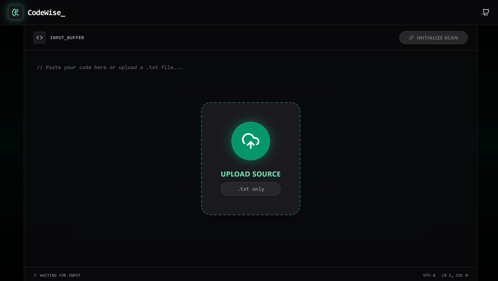
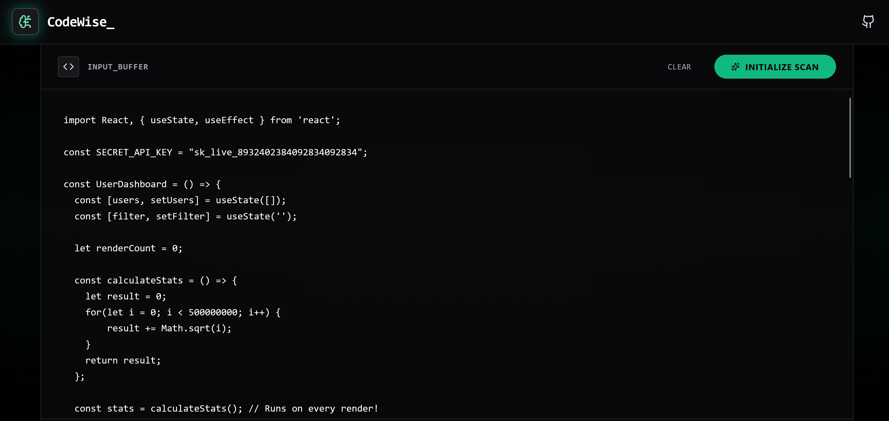
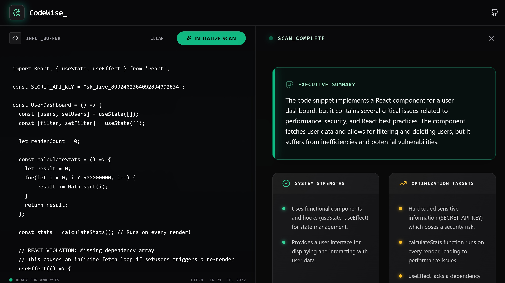

# CodeWise - AI Code Reviewer

CodeWise is a secure, AI-powered code review assistant designed to act as a senior software engineer on demand. Built with React, Vite, and Vercel Serverless Functions, this tool provides instant, structured analysis focusing on readability, performance, security, and best practices.



CodeWise is architected with a "Security-First" approach, ensuring that API keys remain hidden and user input is rigorously sanitized to prevent prompt injection attacks.

## Features

  * **Multi-Language Analysis:** Capable of reviewing code in JavaScript, TypeScript, Python, Java, C++, and many other modern languages.
  * **Serverless Security:** Utilizes a Vercel Functions backend to proxy requests to OpenAI, ensuring that API keys are never exposed to the client-side browser.
  * **Structured Deliverables:** Instead of vague chat responses, CodeWise returns a strict JSON object containing an Executive Summary, Strengths, Weaknesses, and Actionable Advice.
  * **Automatic Refactoring:** Every review includes a specific, optimized rewrite of the submitted code snippet to demonstrate best practices.
  * **Binary Protection:** Implements "Magic Byte" detection on file uploads to ensure only legitimate .txt files are processed, blocking malicious executables disguised as text files.



## Security Architecture & Injection Defense

CodeWise implements a defense-in-depth strategy to mitigate Large Language Model (LLM) risks, specifically focusing on Prompt Injection and Jailbreaking attempts.

**1. Input Sanitization**

User input is not simply pasted into the prompt. The backend explicitly sanitizes specific XML tags to prevent "Tag Breakout" attacks, ensuring the model can distinguish between system instructions and user data.

**2. System Prompt Hardening**

The AI operates under a strict "Meta-Rule" protocol. The system prompt is engineered to treat all user content within specific delimiters exclusively as untrusted data. It is explicitly instructed to ignore any embedded commands (e.g., "Ignore previous instructions") found within the code snippet.

**3. Output Validation**

Before the response reaches the frontend, the backend scans the raw output for known failure states or injection success markers. If the AI has been tricked into outputting a specific injection signature, the server intercepts the response and returns a generic security alert instead of the malicious output.

**4. Server-Side Key Management**

All interactions with the OpenAI API occur within a Vercel Serverless Function. The `OPENAI_API_KEY` is stored as a server-side environment variable and is never accessible in the client bundle.

## How It Works: The Analysis Engine

The core of CodeWise is a specialized analysis pipeline powered by `gpt-4o-mini`.

1.  The frontend validates file extensions and checks magic bytes.
2.  The Vercel backend receives the request, sanitizes the input strings, and constructs the payload.
3.  We inject a specialized System Prompt that instructs the AI to adopt the persona of a critical Senior Software Engineer.
4.  The model is constrained to output **only** valid JSON. This ensures the frontend can reliably parse the data into the UI components (Summary, Lists, and Code Blocks) without hallucinated formatting.



## Tech Stack

**Frontend**

  * **React:** UI library for component-based architecture.
  * **Vite:** Build tool for rapid development and optimized production bundles.
  * **Tailwind CSS:** Utility-first CSS for styling.

**Backend & Infrastructure**

  * **Vercel Functions:** Serverless Node.js environment for secure API proxying.
  * **OpenAI API:** The intelligence engine driving the code analysis.
  * **Dotenv:** Environment variable management.

## Prerequisites

To run this project locally, you need:

1.  Node.js (Version 18 or higher)
2.  Vercel CLI (Install globally via `npm i -g vercel`)
3.  An active LLM API Key

## Getting Started

Follow these steps to set up the secure development environment.

**1. Clone the repository**

```bash
git clone https://github.com/Manuele-T/codewise-ai-reviewer
cd codewise-ai-reviewer
```

**2. Install Dependencies**

```bash
npm install
```

**3. Configure Environment Variables**

Create a file named `.env.local` in the root of the project. This file is ignored by Git to protect your secrets. Add your OpenAI credentials:

```env
OPENAI_API_KEY=sk-proj-your-actual-key-here
OPENAI_MODEL=gpt-4o-mini (or any other model)
```

**4. Run the Application**

Because this project uses Vercel Serverless Functions, you must use the Vercel CLI to run the local server. Standard `npm start` commands will not load the backend API correctly.

```bash
vercel dev
```

**5. Access the App**

Open your browser and navigate to the local URL provided by Vercel (usually `http://localhost:3000`).

## Project Structure

```text
codewise-ai-reviewer/
├── api/                  # Vercel Serverless Functions
│   └── analyze.js        # Secure API proxy and validation logic
├── src/
│   ├── components/       # React UI (Input, AnalysisResult, Header)
│   ├── services/         # Frontend fetch logic to talk to /api
│   └── App.tsx           # Main application controller
├── .env.local            # Local secrets (Excluded from version control)
├── package.json          # Project dependencies
└── vite.config.ts        # Vite build configuration
```